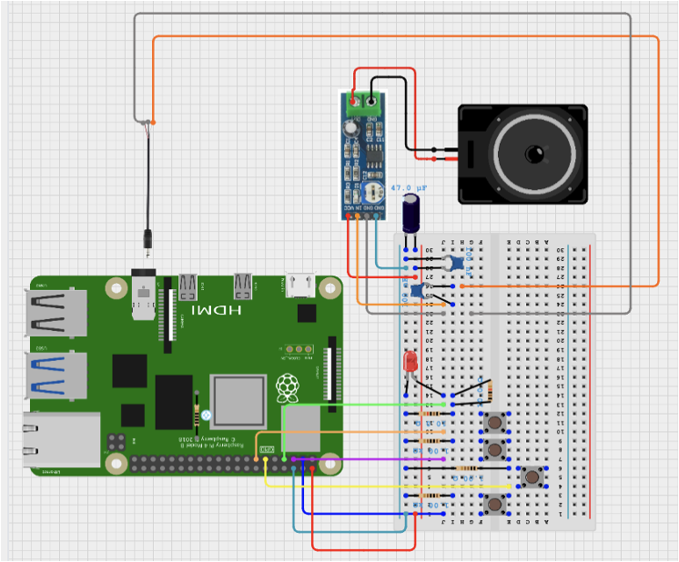

# Raspberry Pi Arcade System

## Overview
This project recreates a classic arcade shooter system inspired by *Galaxian*, where players control a starfighter (the "Hero") to defend Earth from descending alien invaders. Built on a **Raspberry Pi 4**, the game integrates physical GPIO controls with Python-based game development using the Pygame library. Players use buttons to move the starfighter, shoot bullets, and pause/exit the game, while an LED and speaker provide visual and audio feedback. The project demonstrates hardware-software integration, combining circuit design with real-time game mechanics like collision detection, scoring, and health management.

### Key Features
- **Physical Controls**: Four buttons connected to GPIO pins for left/right movement, shooting, and pause/resume/exit functionality.
- **Game Mechanics**: Real-time scoring, hero health system, enemy spawning, and collision detection.
- **Audio Feedback**: Background music, shooting sounds, and explosion effects via a speaker and LM386 amplifier.
- **Visual Feedback**: LED indicator for game status and smooth gameplay on an HDMI monitor.
- **Modular Code**: Split into `plane_main.py` (game loop and hardware control) and `plane_sprites.py` (object definition).

## Prerequisites
### Hardware
- **Raspberry Pi 4** (1GB RAM model is enough, more is better)
- **Power Supply**: Compatible with Raspberry Pi 4 (5V, 3A recommended)
- **microSD Card**: 32GB with Raspberry Pi OS installed
- **HDMI Monitor and micro-HDMI Cable**
- **USB Keyboard and Mouse** (for initial setup)
- **Circuit Components**:
  - 1x Speaker (8 ohms)
  - 1x Breadboard
  - Resistors (10kΩ, 1kΩ)
  - Capacitors (47µF, 0.1µF)
  - 1x Audio Jack (3.5mm to wires: GND, Left, Right channels)
  - Jumper Wires (F/F, F/M, M/M)
  - 4x Push Buttons (Left, Right, Shoot, Pause/Exit)
  - 1x LED
  - 1x LM386 Audio Amplifier Module

    

### Software
- **Operating System**: Raspberry Pi OS 
- **Python**: Version 3.x (pre-installed on Raspberry Pi OS)
- **Libraries**:
  - `pygame`: For game development and audio handling
  - `gpiozero`: For GPIO pin control
- Install dependencies:
  ```bash
  sudo apt update
  sudo apt install python3-pygame
  sudo pip3 install gpiozero
  ```

## Setup Instructions
### Hardware Setup
1. **Assemble the Circuit**:

    
   - Connect buttons to GPIO pins:
     - GPIO 2: Left movement
     - GPIO 3: Right movement
     - GPIO 17: Shoot bullet
     - GPIO 27: Pause (short press) / Exit (long press)
   - Connect LED to GPIO 4 for game status indication.
   - Wire the speaker to the LM386 amplifier module, with audio input from the Raspberry Pi’s 3.5mm audio jack.
   - Use resistors and capacitors as specified for signal stability and noise filtering.
   - Ensure proper grounding (GND: Pin 6) and power (5V: Pin 2) connections.

2. **Test Connections**:
   - Power on the Raspberry Pi and verify that all components are recognized (e.g., buttons trigger GPIO inputs, LED lights up, speaker outputs sound).
   - You may test hardware with files in `testing_hw` folder.

### Software Setup
1. **Clone or Download this Project**:
   - Copy the project files (`plane_main.py`, `plane_sprites.py`, and the `resource` folder) to your Raspberry Pi.

2. **Directory Structure**:
   ```
   /project_folder
   ├── plane_main.py
   ├── plane_sprites.py
   ├── resource/
   │   ├── images/
   │   │   ├── bullet.png
   │   │   ├── bg.jpg
   │   │   ├── enemy/enemy.png
   │   │   ├── hero.png
   │   │   ├── heart.png
   │   │   ├── boom.png
   │   │   ├── gameover.png
   │   │   ├── Pause.png
   │   │   └── Exit.png
   │   ├── sound/
   │   │   ├── gameBackground.mp3
   │   │   ├── shoot.mp3
   │   │   └── explode.mp3
   ```

3. **Resource Files**:
   - Ensure all images and sound files are placed in the `resource` folder as listed above. These assets are critical for visuals and audio feedback.

4. **Permissions**:
   - Ensure the Python scripts have executable permissions:
     ```bash
     chmod +x plane_main.py
     ```

## Usage
1. **Run the Game**:
   - Navigate to the project directory and execute:
     ```bash
     python3 plane_main.py
     ```
   - The game window (600x900 pixels) will open on the HDMI monitor, and the LED will light up to indicate the game has started.

2. **Controls**:
   - **Left Button (GPIO 2)**: Move hero left
   - **Right Button (GPIO 3)**: Move hero right
   - **Shoot Button (GPIO 17)**: Fire bullets
   - **Pause/Exit Button (GPIO 27)**:
     - Short press (<1 sec): Pause or resume the game
     - Long press (≥1 sec): Exit the game

3. **Gameplay**:
   - Start with 5 health points and a score of 0.
   - Destroy enemies with bullets to earn 10 points each.
   - Lose health when enemies hit the hero or pass the bottom of the screen.
   - Game ends when health reaches 0, displaying a "Game Over" screen.

4. **Audio**:
   - Background music loops continuously.
   - Shooting and explosion sounds play on respective actions.

## Troubleshooting
- **No Sound**: Check the audio jack connection and ensure the LM386 module is powered and wired correctly.
- **Buttons Not Responding**: Verify GPIO connections and ensure `gpiozero` is installed.
- **Lag or Crashes**: Reduce screen resolution or ensure no other heavy processes are running (1GB RAM limitation).
- **Game Won’t Start**: Confirm all resource files are in the correct directory and paths in the code match your setup.

## Limitations
- **RAM Constraint**: The 1GB RAM on the Raspberry Pi 4 limits multitasking, causing lag if other processes run alongside the game.
- **Audio Quality**: Some noise may persist due to basic amplification and wiring.
- **Portability**: Current setup requires an external monitor and power supply, limiting mobility.

## Future Enhancements
- **Increase RAM**: Use a Raspberry Pi 4 with 2GB or 4GB RAM for better performance.
- **Audio Upgrade**: Use a standalone LM386 amplifier (not a module) with optimized capacitors and an independent power supply for cleaner sound.
- **Portability**: Integrate a small display, battery, and compact 3D-printed case, potentially using a Raspberry Pi Zero.

## Acknowledgments
- Inspired by the classic *Galaxian* arcade game.
- Built with resources from [Pygame](https://www.pygame.org/), [Raspberry Pi Foundation](https://www.raspberrypi.org/), and [Cirkit Studio](https://www.cirkitstudio.com/).
- Assets sourced from [PNGTree](https://pngtree.com/) and [Vshellboy/plane_war](https://github.com/Vshellboy/plane_war).

## License
This project is for educational purposes and not licensed for commercial use. Feel free to modify and share for non-commercial applications.